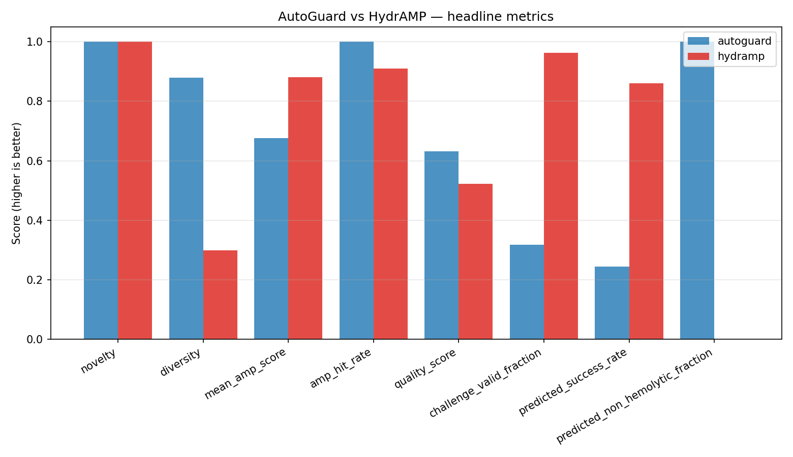
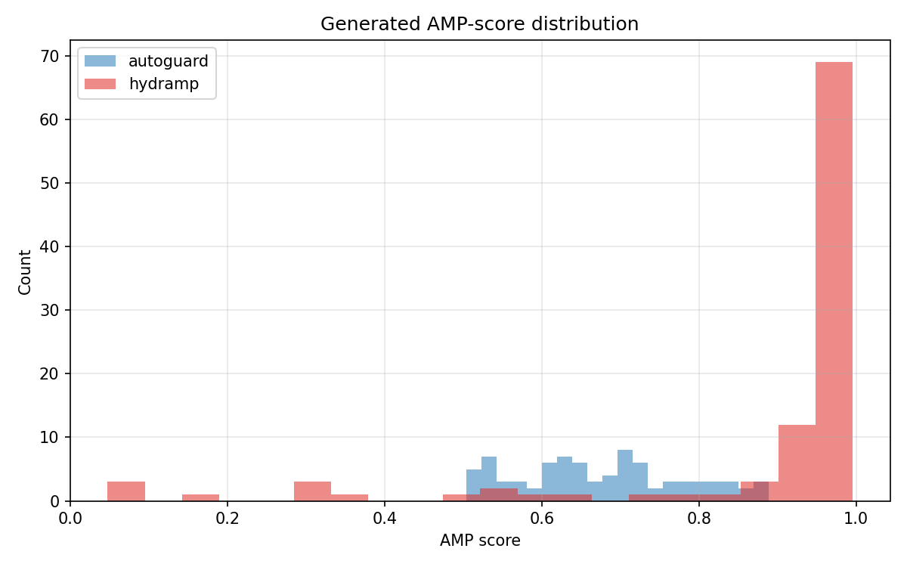
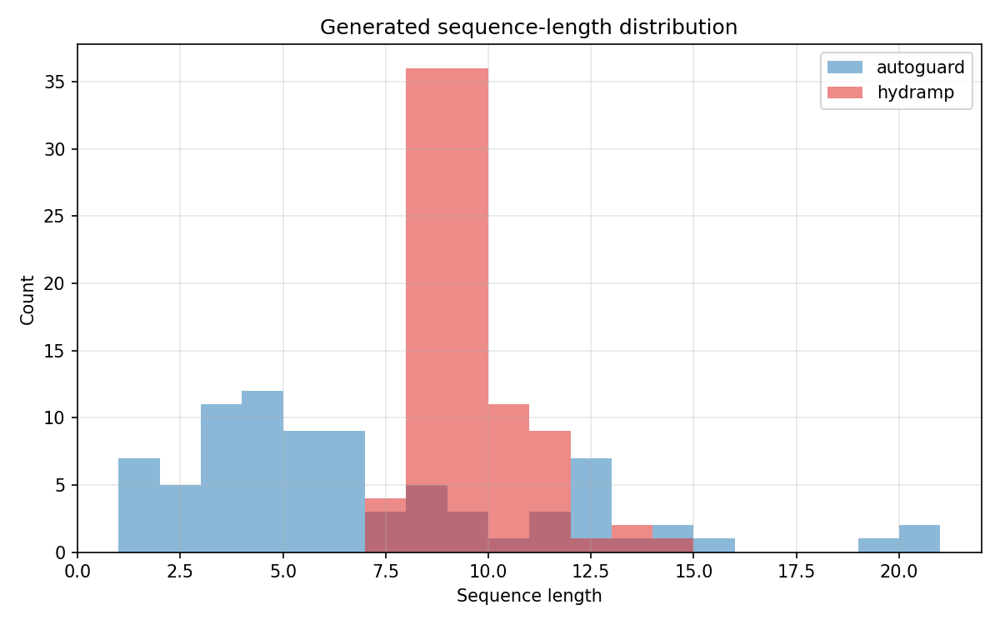
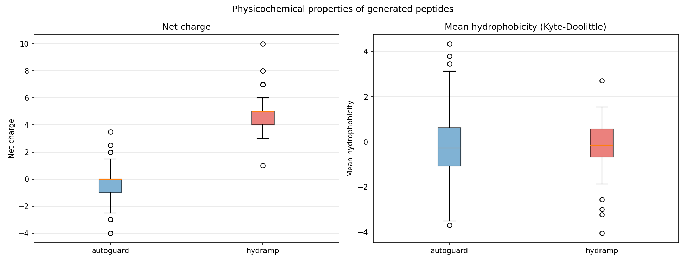

# Model Comparison Report — AutoGuard vs HydrAMP

Models compared: autoguard, hydramp

## Generated-sequence metrics

| Metric | autoguard | hydramp | Winner |
|---|---|---|---|
| num_generated | 82 | 100 | — |
| mean_length | 6.4268 | 9.0100 | — |
| novelty | 1.0000 | 1.0000 | autoguard |
| diversity | 0.8799 | 0.2996 | autoguard |
| mean_amp_score | 0.6759 | 0.8812 | hydramp |
| amp_hit_rate | 1.0000 | 0.9100 | autoguard |
| hydrophobicity_ratio | 0.4312 | 0.4663 | — |
| quality_score | 0.6320 | 0.5224 | autoguard |
| unique_fraction | 1.0000 | 0.5300 | autoguard |
| length_valid_fraction | 0.3171 | 0.9600 | hydramp |
| canonical_fraction | 1.0000 | 1.0000 | autoguard |
| challenge_valid_fraction | 0.3171 | 0.9623 | hydramp |
| num_overlap_reference | 0 | 0 | autoguard |
| predicted_success_rate | 0.2439 | 0.8600 | hydramp |
| predicted_mic50 | 20.8683 | 1.5562 | hydramp |
| predicted_mic90 | 30.0621 | 28.3318 | hydramp |
| predicted_safety_window | 6.1337 | N/A | autoguard |
| predicted_non_hemolytic_fraction | 1.0000 | N/A | autoguard |
| top_k_max_identity | 0.6250 | 0.7500 | autoguard |
| top_k_identity_violations | 0 | 0 | autoguard |

**Overall winner (by quality_score): autoguard**

## Comparison plots

### Metrics comparison

### Amp score distribution

### Length distribution

### Physicochemical comparison

## Sparse Autoencoder (AutoGuard interpretability)

The SAE is an AutoGuard-only interpretability module (HydrAMP has no
equivalent). It decomposes the fused latent into sparse, monosemantic
features.

| SAE statistic | Value |
|---|---|
| input_dim | 48 |
| hidden_dim (features) | 96 |
| alive_features | 96 |
| dead_features | 0 |
| best_loss | 0.0000 |
| sparsity_lambda | 0.001 |
| top_k | 16 |
| num_activations | 5000 |
